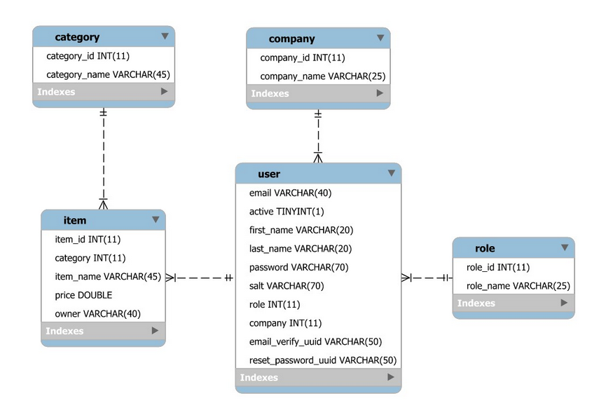

<h1 align="center">Welcome to Home Inventory 👋</h1>

## What project is it?

> This web application helps homeowners keep track of their inventory of household items for insurance purposes. I created this project in the third semester of college <a href="https://www.sait.ca/programs-and-courses/diplomas/information-technology" target='_blank'>(SAIT)</a>.

## Functionality

<ul>
    <li>
Registration:

Users can register (create) an account consisting of an email address, password, first name, and last name.

    
</li>
    <li>
Authentication:

Users can login using an email address and password and logout.
        </li><li>
Manage User Account:

Users can edit their account information, but they cannot delete their own account.
    </li>
    <li>
Reset password:

If a user forgets their password, they will have the option to reset their password. If they choose to reset a password, they will receive an email containing a link which will send them to a page to enter a new password.
</li>
    <li>
        Account Active/Inactive:

Users can deactivate their account from the account page. If an account has been deactivated, the user cannot log in. Only a system administrator can reactive their account.
        </li>
    <li>
Manage Inventory:

A home inventory item consists of category, name, and price. Users can view, add, delete and edit their own items.
Manage Users, Roles and Categories:

A system administrator is able to manage all aspects of the system below. A company administrator, on the other hand, can only manage users of the same company as them.

    
</ul>

## Languages

   

## Structure of the program

